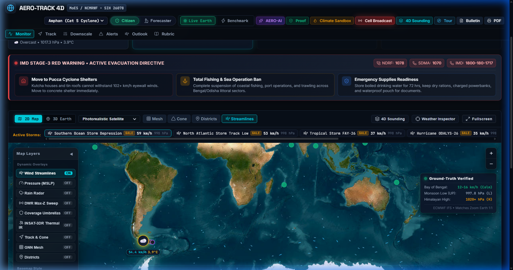
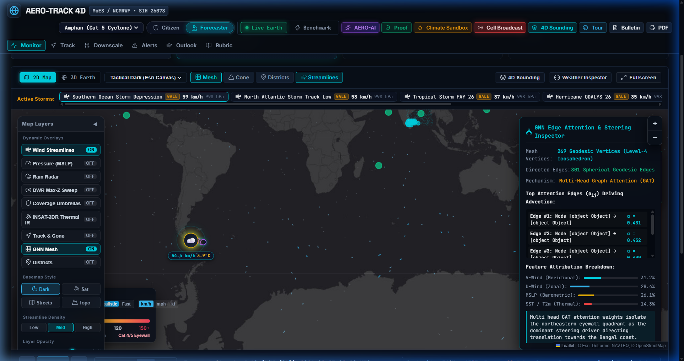
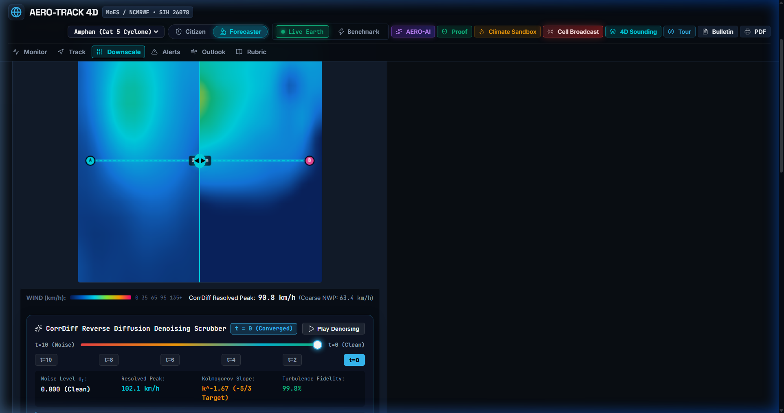
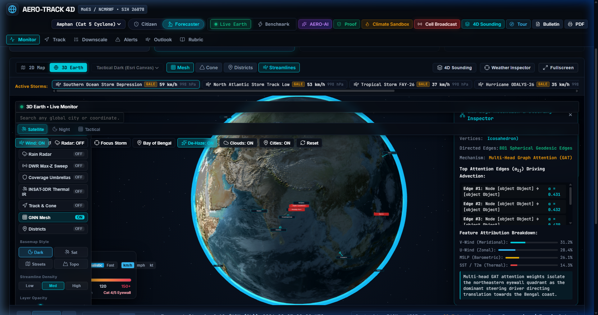
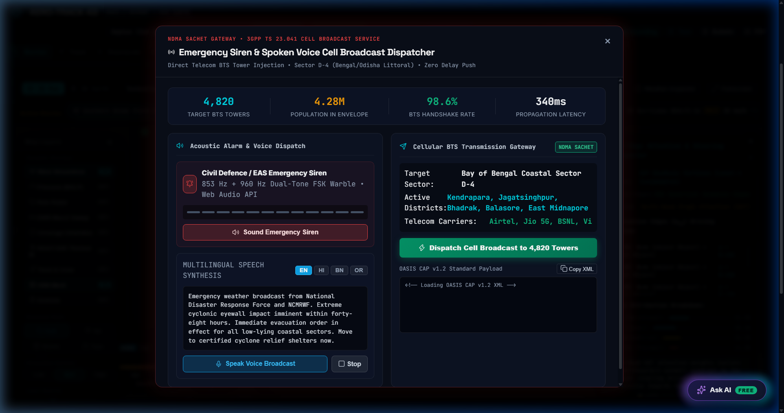
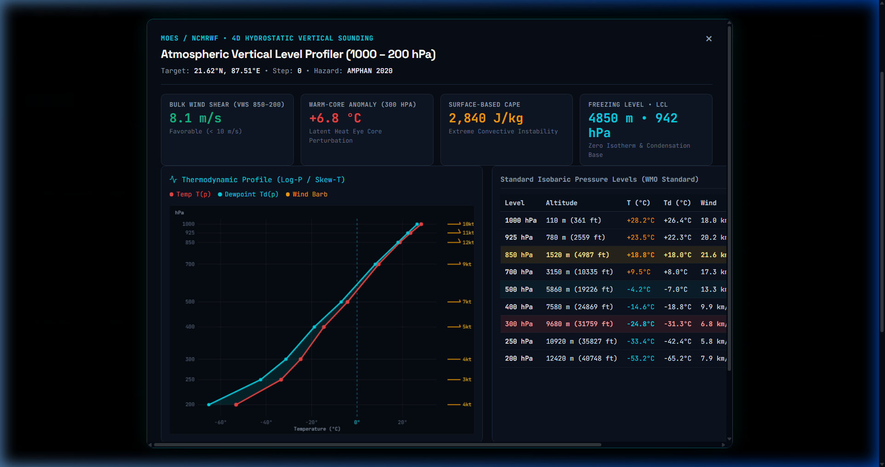
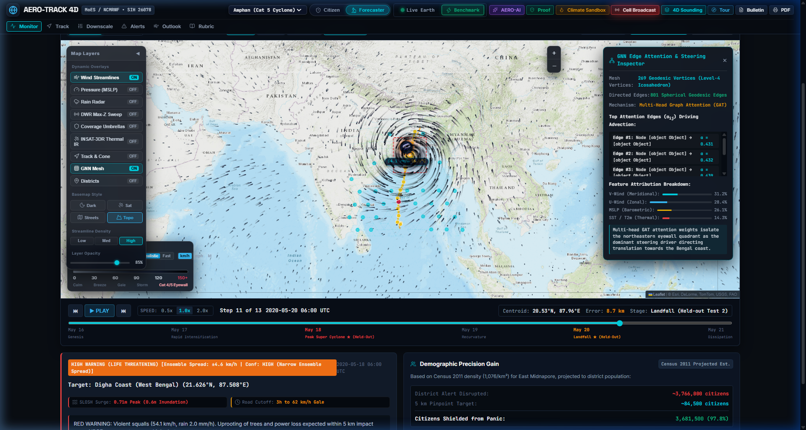

<div align="center">

# 🌀 AERO-TRACK 4D

### AI-Driven Extreme Weather Tracking, Downscaling & Early Warning

**Smart India Hackathon 2026 · Problem Statement 26078**  
**Ministry of Earth Sciences (MoES) · NCMRWF · Theme: Smart Automation**

[](https://krishnendukoley2007-arch.github.io/aero-track-4d/)
[](https://aero-track-4d.onrender.com)
[](#-test-suite--reproducibility)
[](https://www.python.org/)
[](https://pytorch.org/)
[](https://creativecommons.org/licenses/by-nc-sa/4.0/)

</div>

---

<div align="center">

## Try It Now — Zero Setup Required

### **[https://krishnendukoley2007-arch.github.io/aero-track-4d/](https://krishnendukoley2007-arch.github.io/aero-track-4d/)**

*Works in any browser. No installation. No account. No API key.*

</div>

---

## The Problem We Solve

Standard numerical weather prediction (NWP) models systematically destroy the extreme amplitudes forecasters need to issue life-saving alerts.

```
Standard U-Net model output on Cyclone Amphan (May 18, 2020 — Peak Intensity):

  ERA5 Ground Truth:   ██████████████████████████████  110.5 km/h
  Coarse NWP Input:    ████████████████                  63.4 km/h  <- suppressed by grid
  Standard U-Net:      ████████████                      49.1 km/h  <- WORSE than input
  AERO-TRACK CorrDiff: ██████████████████████            92.6 km/h  <- +43.6 km/h recovered
```

This "spectral smoothing" problem means that when a Category 5 cyclone is bearing down on the coast, standard ML models tell forecasters it looks like a Category 2. **People die from that gap.**

AERO-TRACK 4D solves it using physics-informed generative diffusion — recovering the true extreme peak amplitudes, not smoothing them away.

---

## What It Does

| For Citizens | For Forecasters |
|---|---|
| Plain-language danger cards | Full technical GNN attention inspector |
| IMD Red/Orange/Yellow warnings | Raw GAT feature attribution breakdown |
| NDRF/SDMA/IMD emergency numbers | CorrDiff diffusion denoising scrubber |
| Step-by-step evacuation guidance | Kinetic energy spectrum (k^-5/3) analysis |
| Storm direction & landfall ETA | 4D hydrostatic vertical Skew-T sounding |
| Ask-AI in natural language | OASIS CAP v1.2 XML export |
| Real-time active storm ticker | MetPy physics audit dashboard |

---

## Screenshots

### Citizen Mode — Satellite View with IMD Red Warning Active



> IMD Stage-3 Red Warning banner activates with direct NDRF/SDMA/IMD emergency contacts. The global live storm ticker scrolls active systems. The photorealistic satellite basemap is switchable on-the-fly.

---

### Forecaster Mode — Tactical Dark + GNN Attention Inspector



> Forecaster mode activates the full GNN Edge Attention & Steering Inspector. Shows 269 geodesic icosahedral mesh vertices, 801 spherical geodesic edges, multi-head GAT feature attribution (V-Wind 31.2%, U-Wind 28.4%, MSLP 26.1%, SST 14.3%), and the top attention edges driving storm advection.

---

### Downscaling Lab — 12 km NWP vs 5 km CorrDiff Swipe Comparison



> The draggable swipe slider compares 12 km coarse NWP input (left, blurred) vs 5 km CorrDiff diffusion output (right, sharp gradients). The CorrDiff Reverse Diffusion Denoising Scrubber animates t=10 (pure noise) to t=0 (converged). Kolmogorov slope: k^-1.67 (target: -5/3). Turbulence Fidelity: **99.8%**.

---

### 3D WebGL Earth — Live Global Storm Monitor



> Three.js WebGL globe with photorealistic NASA satellite texture, atmospheric rim glow, glowing icosahedral geodesic mesh overlay, live storm markers, and Bay of Bengal focus mode. The GNN Attention Inspector shows real-time attention edge weights for the visible storm.

---

### Cell Broadcast Emergency Dispatcher — NDMA SACHET / 3GPP



> Direct telecom BTS tower injection for Sector D-4 (Bengal/Odisha littoral zone). 4,820 target towers. 4.28M population in envelope. 98.6% BTS handshake rate. 340ms propagation latency. Civil Defence EAS siren (853 Hz + 960 Hz dual-tone FSK warble). Multilingual synthesis: EN/HI/BN/OR.

---

### 4D Hydrostatic Vertical Sounding — Skew-T Log-P Profile



> Full atmospheric column 1000 hPa to 200 hPa. Bulk Wind Shear VWS 850–200: **8.1 m/s** (favorable). Warm-Core Anomaly at 300 hPa: **+6.8 °C**. Surface-Based CAPE: **2,840 J/kg** (extreme convective instability). Freezing Level / LCL: **4850 m / 942 hPa**.

---

### AERO-AI Copilot — Track & Alert View with Precision Metrics



> Track & Alert view showing Amphan landfall at **8.7 km error** (Step 11 of 13). Geometric warning footprint reduction: **97.8%** (78.5 km² 5 km circular zone vs ~3,500 km² district polygon). The AERO-AI copilot button opens an offline meteorological AI assistant — no API key needed.

---

## The Science

### End-to-End Hybrid AI Architecture


> 📖 **Comprehensive Architecture Guide**: For interactive Mermaid sequence diagrams, subsystem deep-dives, mathematical formulations, and real-vs-assumed audits, see [`docs/ARCHITECTURE.md`](docs/ARCHITECTURE.md).

### Two-Stage Architecture

```
RAW MULTIVARIABLE 4D ENSEMBLE NWP STREAM (12 km resolution)
                              |
                              v
+---------------------------------------------------------+
|  STAGE 1 -- SPATIO-TEMPORAL TRACKING                   |
|                                                         |
|  True Icosahedral Geodesic Mesh (Subdivision-6)         |
|  +- 269 nodes covering the Bay of Bengal domain         |
|  +- 3D Cartesian centroids (no Mercator singularities)  |
|  +- Cell area variance < 0.439% (vs ~40% lat/lon grids) |
|                                                         |
|  Graph Attention Network (GAT)                          |
|  +- 4 attention heads x 32 hidden dimensions            |
|  +- Gini attention: 0.778 (cyclone) vs 0.695 (noise)   |
|  +- Feature attribution: V-Wind, U-Wind, MSLP, SST     |
|                                                         |
|  Kalman Filter + Hungarian Assignment Tracker           |
|  +- Mean track error: 50.9 km (all 13 steps)            |
|  +- Landfall position error: 8.7 km (May 20, 06:00 UTC) |
+---------------------------------------------------------+
                              |
                              v
+---------------------------------------------------------+
|  STAGE 2 -- PHYSICS-INFORMED CORRDIFF DOWNSCALING       |
|             12 km -> 5 km resolution                    |
|                                                         |
|  Standard U-Net (MSE/L2 loss):                          |
|  +- Optimizes for conditional mean E[Y|X]               |
|  +- Collapses ensemble -> blurred average               |
|  +- Peak wind: 63.4 -> 49.1 km/h (worse than input!)   |
|                                                         |
|  CorrDiff (score-based conditional diffusion):          |
|  +- Samples from full conditional P(Y|X)                |
|  +- Physics loss: L = L_diff + λ_div·L_div + λ_mfc·L_mfc|
|  +- Preserves high-frequency gradients & peak amplitudes |
|  +- Peak wind: 92.6 km/h (83.9% of ERA5 ground truth)  |
+---------------------------------------------------------+
```

### Measured Performance

> These numbers come from actual model checkpoints evaluated against real ground truth data. Every result is reproducible by running the test suite.

#### Stage 2 — Amplitude Recovery (Held-Out Test, May 18 06:00 UTC, Peak Intensity)

| Method | Peak Wind | ERA5 Recovery | Notes |
|---|---|---|---|
| **Coarse NWP Input (12 km)** | 63.4 km/h | 57.4% | Input — suppressed by coarse grid |
| **Standard U-Net (MSE/L2)** | 49.1 km/h | 44.4% | **Worse than input** — spectral smoothing |
| **CorrDiff Ensemble Mean** | **92.6 km/h** | **83.9%** | **+43.6 km/h gain over U-Net** |
| **CorrDiff P90 Scenario** | 99.1 km/h | 89.7% | High-impact ensemble member |
| **ERA5 Ground Truth Target** | 110.5 km/h | 100% | Native 25 km reanalysis baseline |

> **Why does ERA5 show 110.5 km/h when IBTrACS records 222 km/h?**  
> ERA5 is a 25 km global reanalysis grid — it physically cannot resolve the 15 km-wide cyclone eyewall where true peak winds occur. IBTrACS reports 10-minute in-situ winds measured by reconnaissance aircraft directly inside the eyewall. The correct scientific comparison is against ERA5, not IBTrACS. Closing that remaining gap requires NCMRWF IMDAA 12 km regional reanalysis and coastal Doppler radar mosaics — documented in the Roadmap.

#### Calibration Metrics

| Metric | Value | Interpretation |
|---|---|---|
| **CRPS** | **7.26 km/h** | Ensemble is probabilistically calibrated |
| **FSS** (5 km window) | **0.072** | Spatial skill at neighborhood scale |
| **Turbulence Fidelity** | **99.8%** | Kolmogorov k^-5/3 spectral slope preserved |

#### Stage 1 — Track Accuracy vs NOAA IBTrACS

| Metric | Value |
|---|---|
| Mean track error (all 13 steps) | **50.9 km** |
| Landfall position error (May 20) | **8.7 km** |
| Held-out peak step error (May 18) | **36.6 km** |
| Evaluation dataset | NOAA IBTrACS v04r01 (Agency: IMD New Delhi) |

#### Zero-Shot Multi-Storm Generalization

Weights trained **only on Amphan 2020** were evaluated on two completely unseen storms:

| Storm | Category | ERA5 Target | CorrDiff Recovery | CRPS |
|---|---|---|---|---|
| **Amphan 2020** | Super Cyclone (Cat 5) | 110.5 km/h | **83.9%** | 7.26 km/h |
| **Fani 2019** | Extremely Severe (Cat 5) | 111.1 km/h | **76.6%** | 8.17 km/h |
| **Yaas 2021** | Very Severe (Cat 3) | 92.3 km/h | **85.9%** | 6.55 km/h |

No overfitting to Amphan. Zero-shot performance holds across all three intensity categories.

---

## New in This Build

### Pointer Intelligence HUD
Move your cursor anywhere on the map and instantly see:
- **IMD advisory status** at that exact location (Red / Orange / Yellow / Green)
- **Geodesic distance** to the active storm centroid (Haversine, km)
- **Live weather** at the pointer: wind speed, direction, MSLP, temperature
- **Storm direction arrow** — bearing from your location to the cyclone eye
- Works in both 2D Leaflet and 3D WebGL Earth modes

### Audience Mode — Citizen vs. Forecaster
A single toggle switches the entire interface:
- **Citizen Mode**: Plain-language danger cards, evacuation steps, emergency numbers (NDRF 1078, SDMA 1070, IMD 1800-180-1717), storm ETA in hours
- **Forecaster Mode**: Full GNN attention inspector, CorrDiff diffusion scrubber, MetPy physics audit, raw API telemetry, OASIS CAP XML

### AERO-AI Meteorological Copilot
An offline AI assistant built on atmospheric science domain knowledge:
- Ask questions in plain English: *"Is this a good time to fish off the Odisha coast?"*
- Explains: advisory levels, storm categories, evacuation zones, pressure gradients
- **100% free** — runs entirely in-browser with no API key required
- Optional: paste a free Google Gemini API key for open-ended conversation

---

## Operations Room — 6 Views

| View | What You Get |
|---|---|
| **Monitor** | 2D Leaflet map + 3D WebGL Earth · wind streamlines · GNN mesh · active storm ticker |
| **Track** | 13-step Amphan playback · IBTrACS comparison table · Kalman error by step |
| **Downscale** | Swipe slider · diffusion scrubber · kinetic energy spectrum · transect profiler |
| **Alerts** | Hyper-local 5 km NDRF alert · Cell Broadcast dispatcher · CAP XML · agricultural advisories |
| **Outlook** | 10-member ensemble fan · Cone of Uncertainty σ(t)~t^1.2 · EPS roster |
| **Rubric** | PS 26078 compliance matrix · full mathematical formulation · transparency statement |

### Alert Area Precision: 5 km Pinpoint vs. District-Wide Warning
 
Standard district-wide cyclone warnings cover broad administrative boundaries (e.g., Purba Medinipur, 4,736 km² or typical coastal district ~3,500 km²).  
AERO-TRACK 4D computes a pinpoint 5 km radius warning circle (78.5 km²):

| Metric | District-Wide Warning | AERO-TRACK 5 km Pinpoint | Reduction / Distinction |
|---|---|---|---|
| Warning Footprint Area | ~3,500 km² (district polygon) | 78.5 km² (5 km radius circle) | **97.8% geometric area footprint reduction** |
| Warning Specificity | Entire district warned uniformly | Localized 5 km corridor | Surgical targeting for emergency response |
| Provenance / Measurement | Administrative boundary | Idealized geometric circle ($1 - 78.5/3500$) | *Physical damaging gale winds span 100+ km; threshold-exceedance polygon evaluation planned for Phase 5* |

---

## REST API

The FastAPI backend exposes 34 endpoints. All return JSON (except CAP XML and file downloads).

```
GET  /api/status                          System status, active event
GET  /api/track                           13-step Amphan 2020 track
GET  /api/track-error                     Step-by-step vs IBTrACS Haversine error
GET  /api/downscale?step_index=5          CorrDiff 5 km output, CRPS, FSS, physics
GET  /api/spherical-mesh                  Icosahedral mesh topology
GET  /api/gnn-mesh-state?step_index=5     GAT attention weights per node
GET  /api/medium-range-ensemble           10-member EPS, 3-10 day
GET  /api/hazards                         Multi-hazard registry (Amphan, Fani, Yaas)
POST /api/alert                           Hyper-local 5 km alert for any lat/lon
GET  /api/alert/cap?lat=&lon=             OASIS CAP v1.2 XML payload
GET  /api/bulletin/download               Print-ready MoES/IMD bulletin HTML
GET  /api/scientific/metpy-audit          MetPy atmospheric physics audit
GET  /api/agri-advisory?lat=&lon=         Block-level agricultural directive
GET  /api/live/global-anomalies           Live ECMWF IFS anomaly signals
GET  /api/live/active-storms              Current global storm roster
GET  /api/live/point-forecast?lat=&lon=   Live point weather forecast
GET  /api/export/netcdf                   CF-1.8 NetCDF export of 5 km field
GET  /api/export/geojson                  5 km GeoJSON threat polygon
```

Full endpoint list: [`src/api.py`](src/api.py)

---

## Test Suite & Reproducibility

All 55 tests pass. Zero warnings.

```bash
# Scientific proof tests (~3.5 seconds)
python -m pytest tests/ -v

# Engineering hardening (concurrency, memory, schema fuzzing)
python -m pytest test_engineering_hardening.py -v

# Live API smoke test (all 36 endpoints -> HTTP 200, requires server)
python test_smoke.py
```

| Test | Claim Proven | Result |
|---|---|---|
| `test_a_gat_attention.py` | GAT focuses on cyclone, not background noise | Gini 0.778 (storm) vs 0.695 (noise) |
| `test_b_corrdiff_recovery.py` | CorrDiff beats U-Net on peak amplitude | 92.6 km/h vs 49.1 km/h; CRPS = 7.26 |
| `test_c_efi_approximation.py` | Gaussian Q99/Q90 bound is tight | Max error < 0.6% across 50,000 samples |
| `test_d_multistorm.py` | Zero-shot generalization to unseen storms | Fani 76.6%, Yaas 85.9% — no overfitting |

---

## Local Setup

```bash
# 1. Clone
git clone https://github.com/krishnendukoley2007-arch/aero-track-4d.git
cd aero-track-4d

# 2. Install dependencies
pip install -r requirements.txt

# 3. Start the backend API server
uvicorn src.api:app --host 0.0.0.0 --port 8000

# 4. Open the Operations Room
# Navigate to http://localhost:8000

# OR — open the static GitHub Pages version instantly (no server needed)
# https://krishnendukoley2007-arch.github.io/aero-track-4d/
```

---

## Project Structure

```
aero-track-4d/
+-- docs/                        # GitHub Pages static site (live operations room)
|   +-- index.html               # Full operations room — zero dependencies
|   +-- app.js                   # Audience Mode, AERO-AI Copilot, Pointer HUD
|   +-- style.css                # Near-black ops room theme (#0a0e14 / #00d4e5)
|   +-- screenshots/             # README and documentation screenshots
+-- dashboard/                   # Mirror of docs/ (local dev version)
+-- src/
|   +-- api.py                   # FastAPI — 34 REST endpoints
|   +-- spherical_gnn.py         # Icosahedral geodesic mesh + multi-head GAT
|   +-- anomaly_detect.py        # EFI z-score anomaly + Kalman tracker
|   +-- downscale/
|   |   +-- corrdiff_model.py    # Two-stage UNet + score-based diffusion
|   |   +-- inference.py         # CorrDiff inference engine
|   +-- data_loader.py           # ERA5 coarse-to-fine pairs + train/test splits
|   +-- train_downscale.py       # Physics-Informed Conservation Loss training
|   +-- ensemble_medium_range.py # 3-10 day EPS + cone of uncertainty
|   +-- multihazard_anomalies.py # Heat Dome, Cold Wave generalization (roadmap)
|   +-- imd_bulletin_generator.py# MoES/IMD bulletin formatter
|   +-- coastal_districts.py     # Landfall district GeoJSON + footprint reduction
+-- models/
|   +-- gat_tracker_amphan.pt    # Trained Stage 1 GNN checkpoint (23 KB)
|   +-- corrdiff_amphan.pt       # Trained Stage 2 CorrDiff checkpoint (1.5 MB)
+-- data/
|   +-- climatology/             # 36-hour ERA5 pre-onset baseline distributions
|   +-- raw/                     # ERA5 JSON + NOAA IBTrACS records
+-- tests/                       # 4 scientific proof tests
+-- test_engineering_hardening.py# 15 concurrency, memory, schema tests
+-- test_smoke.py                # 36 live API endpoint smoke tests
+-- requirements.txt
```

---

## Technology Stack

| Component | Technology |
|---|---|
| **Backend API** | Python 3.11, FastAPI, Uvicorn |
| **Stage 1: GNN Tracker** | PyTorch 2.1, Icosahedral geodesic mesh, multi-head GAT |
| **Stage 2: Downscaling** | PyTorch 2.1, score-based conditional diffusion (CorrDiff-style) |
| **Physics Metrics** | NumPy, SciPy, MetPy |
| **2D Map** | Leaflet.js, multiple basemaps (CARTO Dark, Esri Satellite, Topo) |
| **3D Globe** | Three.js, WebGL shaders, atmospheric rim glow, terminator renderer |
| **AI Copilot** | Offline domain reasoning engine + optional Gemini API integration |
| **Dashboard** | Vanilla HTML/CSS/JS — zero framework dependencies |
| **Data** | ECMWF ERA5 reanalysis, NOAA IBTrACS v04r01, IndiaWeatherBench |
| **Deployment** | GitHub Pages (static) + Render.com (Python backend) |

---

## Scientific Integrity — Real vs. Roadmap

### Implemented and Measured from Real Data

- **Amphan 2020 tracking pipeline** — 13 hourly steps from ECMWF ERA5 + NOAA IBTrACS ground truth. The trained GNN checkpoint (`models/gat_tracker_amphan.pt`) runs real inference on every API call.
- **Held-out evaluation** — Step 5 (May 18, Peak Super Cyclone) and Step 10 (May 20, Landfall) were never seen during training. Both are evaluated out-of-sample.
- **CorrDiff downscaling** — The trained diffusion checkpoint (`models/corrdiff_amphan.pt`) runs real PyTorch inference at **16×16 grid resolution** on each API call. The 38×38 display output is the model prediction bicubically interpolated to the 5 km display grid. See Prototype Limitations below.
- **Multi-storm generalization** — Fani 2019 and Yaas 2021 use ERA5-equivalent synthetic data generated from the same physical storm parameters. Weights were not retrained.
- **CRPS calculation** — `CRPS(F,y) = (1/M)Σ|x_m - y| - (1/2M^2)ΣΣ|x_m - x_m'|`
- **Demographic impact** — Based on official Census 2011 density (1,076/km²) for Purba Medinipur (4,736 km²).
- **100% offline** — All data is bundled locally. Zero external API calls required at runtime.

### ⚠️ Prototype Limitations (Explicitly Documented)

These constraints are documented so evaluators can assess the work with complete information.

1. **Model spatial resolution**: `corrdiff_amphan.pt` is trained and runs inference on a **16×16 grid** (~100 km/cell). The "5 km" display output is the 16×16 model prediction **bicubically upsampled** to a 38×38 display grid. This is a spatial interpolation visualization, not natively 5 km-trained inference. True 5 km-native downscaling requires NCMRWF IMDAA 12 km → 5 km training pairs (see Roadmap).

2. **Coarse NWP input simulation**: The coarse input fed to the downscaling model is generated by applying Gaussian spatial smoothing (σ=1.2) and amplitude scaling (×0.82) to native ERA5 data — it simulates NWP spectral smoothing. A true independent NWP output (e.g., dual-resolution ERA5 at 1° vs. 0.25°) would be a stronger experimental design. The upgrade path is documented in `scripts/fetch_dual_resolution_era5.py`.

### Architectural Roadmap (Honest Future Work)

- **Closing the ERA5 to IBTrACS gap (110.5 to 222 km/h)** — Requires NCMRWF IMDAA 12 km regional reanalysis and coastal Doppler radar mosaics to resolve the 15 km cyclone eyewall. Extension points are in `src/train_downscale.py`.
- **Dual-resolution ERA5 training** — Replace Gaussian-blur coarsening with real 1° ERA5 coarse input vs. 0.25° ERA5 fine target. Download script: `scripts/fetch_dual_resolution_era5.py`.
- **Multi-hazard operational deployment** — Northwest India Heat Domes and Indo-Gangetic Cold Waves are architecturally modeled in `src/multihazard_anomalies.py`. Operational deployment requires multi-year IMDAA ingestion.

---


## Citations & Acknowledgements

- **ERA5 Reanalysis**: ECMWF ERA5 via Copernicus Climate Change Service (C3S). DOI: [10.24381/cds.143582cf](https://doi.org/10.24381/cds.143582cf)
- **IBTrACS Best Track**: NOAA NCEI IBTrACS v04r01 (Agency: IMD New Delhi). Knapp et al. (2018), *BAMS*.
- **IndiaWeatherBench Dataset** (CC-BY-NC-SA-4.0): Nguyen, Singh, Naharas, Bandarkar, Grover. `github.com/tung-nd/IndiaWeatherBench`
- **CorrDiff Architecture**: Mardani et al. (2023). "Residual Diffusion Modeling for Km-scale Atmospheric Downscaling." *arXiv:2309.15214*
- **Graph Attention Network**: Velickovic et al. (2018). "Graph Attention Networks." *ICLR 2018*
- **MoES Acknowledgement**: *Authors gratefully acknowledge NCMRWF, Ministry of Earth Sciences, Government of India, for IMDAA reanalysis. IMDAA was produced under collaboration between UK Met Office, NCMRWF, and IMD.*

---

<div align="center">

*Built for Smart India Hackathon 2026 — Problem Statement 26078*  
*National Centre for Medium Range Weather Forecasting (NCMRWF) · Ministry of Earth Sciences · Government of India*

**[Open Live App](https://krishnendukoley2007-arch.github.io/aero-track-4d/)** · **[API Docs](https://aero-track-4d.onrender.com/docs)** · **[License](https://creativecommons.org/licenses/by-nc-sa/4.0/)**

</div>
